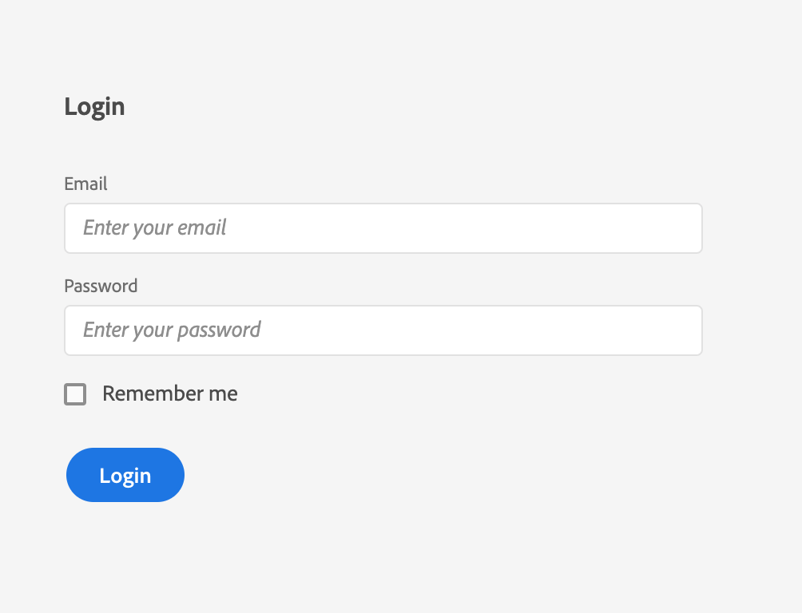

## Lesson 3: React Spectrum

The React Spectrum project implements the Spectrum design language into React UI components.

React Spectrum is composed of three parts:

* react-spectrum, a component library implementing the Adobe Spectrum design system.
* react-aria, a library of React hooks implementing the patterns defined in the ARIA practices spec, including mouse, touch, and keyboard behavior, accessibility, and internationalization support.
* react-stately, a library of React hooks implementing cross platform (e.g. web/native) state management for components that need it.

React Spectrum enables accessibility and common behavior to be handled out of the box. Leveraging React Spectrum allows you to save front end development time, and focus on styling and other design specific features that can be built on top of the library.

If you're not familiar with React, please read the [React getting started guide](https://reactjs.org/docs/getting-started.html). 

### Using React Spectrum 

React Spectrum is usable with a module bundler like [Parcel](https://parceljs.org/). 
Components are then usable as in the following example. The styles for each component you import will be bundled along-side the JavaScript. Each component should be imported independently - this way only the components you use will be included in the output JavaScript and CSS files.

### Building a simple form using React Spectrum

This example will show you how easy it is to build a simple form using React Spectrum components.

To get started, install the following components:

`yarn add @react-spectrum/provider @react-spectrum/theme-default @react-spectrum/button @react-spectrum/textfield @react-spectrum/form @react-spectrum/checkbox`

*Note*: if you don't have yarn installed, run `npm i -g yarn` first.

Then you can start with importing the components to build the form: 

```javascript
import ReactDOM from 'react-dom';
// Import root provider and theme
import {Provider} from '@react-spectrum/provider';
import {theme} from '@react-spectrum/theme-default';

// Import the needed components
import {Button} from '@react-spectrum/button';
import {Form} from '@react-spectrum/form';
import {Checkbox} from '@react-spectrum/checkbox';
import {TextField} from '@react-spectrum/textfield';
```

Then render them using with e.g. [ReactDOM](https://fr.reactjs.org/docs/react-dom.html): 

```html
ReactDOM.render(
  <Provider theme={theme} typekitId="mge7bvf">
    <h3 id="login-label">Login</h3>
    <Form width={192} aria-labelledby="login-label">
      <TextField label="Email" placeholder="Enter your email" />
      <TextField label="Password" placeholder="Enter your password" type="password" />
      <Checkbox>Remember me</Checkbox>
    </Form>
    <Button variant="cta">Login</Button>
  </Provider>
, document.getElementById('root'));
```

Provider is the containing component that all other React Spectrum components are the children of.
The Provider's theme is the CSS variables for colorScheme and scale values.
 
Read the [React documentation](https://react-spectrum.adobe.com/docs/react-spectrum/Provider.html) for more details.

**Note**: A Typekit ID is required to use the suggested Adobe fonts. Visit https://typekit.com/account/kits to create one. The default is only intended for prototyping work.

Finally you should see the same result as in the previous lesson [Spectrum CSS](spectrum-css.md) unless you have dark mode enabled on your OS, then you would see the spectrum dark theme instead.

 

Next: [Well done](/lessons/welldone.md). 